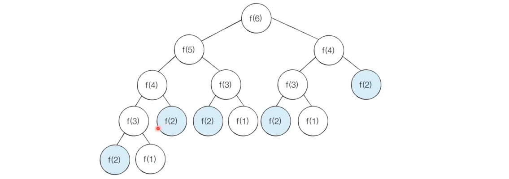

# 다이나믹 프로그래밍

## Dynamic Programming
- 메모리를 적절히 사용하여 수행 시간 효율성을 비약적으로 향상

- 이미 계산된 결과(작은 문제)는 별도의 메모리 영역에 저장하여 **다시 계산하지 않도록**한다. 

- 다이나믹 프로그래밍의 구현은 일반적으로 두 가지(탑다운, 바텀업) 방식으로 구성된다.

- 파이썬의 리스트와같은 동적 할당과는 다른의미..

## 다음의 조건을 만족할 때 사용한다
    - `최적 부분구조` : 큰 문제를 작은 문제로 나눌 수 있으며 작은 문제의 답을 모아서 큰 문제를 해결할 수 있다. 

    - `중복되는 부분 문제` : 동일한 작은 문제를 반복적으로 해결한다.

## 피보나치 수열
- 피보나치 수열은 다이나믹 프로그래밍으로 효과적으로 계산할 수 있다.
    - 특정 번자의 숫자를 구할때 앞에 두 수를 합하여 구할 수 있다.
    - `점화식`이란 인접한 항들 사이의 관계식을 의미한다.

- 중복되는 부분문제가 존재한다.


```python
# 지수시간 복잡도
def fibo(x):
    # 재귀함수 종료 조건 (a1과 a2)
    if x == 1 or x == 2:
        return 1
    return fibo(x-1) + fibo(x-2)
print(fibo(4))
```

- n = 100 만되어도 위의 피보나치수는 계산할 수 없다.


## 메모이제이션

- top-down 방식으로 `한 번 계산한 결과를 메모리 공간에 메모`하는 기법
    - 같은 문제를 다시 호출하면 메모했던 결과를 그대로 가져온다.
    - 값을 기록해 놓는다는 점에서 `캐싱`이라고 한다.
        - 결과 저장용 리스트는 `DP 테이블`이라고 부른다.

- 탑다운 기법 소스코드드
```python
# 한 번 계산된 결과를 메모이제이션(Memoization)하기 위한 리스트 초기화
d = [0] * 100

# 피보나치 함수를 재귀함수로 구현(탑다운 다이나믹 프로그래밍)
def fibo(x):
    #종료조건
    if x ==1 or x ==2 :
        return 1
    # 이미 계산된 피보나치 수라면(이미 해결되었다면면)
    if d[x] != 0:
        return d[x]
    # 아직 계산하지 않은 문제라면 점화식에 따라서 결과를 테이블에 저장
    d[x] = fibo(x-1) + fibo(x-2)
    return d[x]
print(fibo(99))
```


- 바텀업 소스코드
    - 작은문제를 미리 해결해놓고 큰 문제를 향해 간다다
```python
# 테이블 초기화
d = [0] * 100

# 첫 번째 피보나치 수와 두 번째 피보나치 수는 1
d[1] = 1
d[2] = 1
n = 99

# 피보나치 함수를 반복문으로 구현
for i in range(3,n+1):
    d[i] = d[i-1] + d[i-2]
print(d[n])
```

# 다이나믹 프로그래밍 vs 분할정복

- 모두 최적 부분 구조를 가질 때 사용할 수 있다
    - 큰 문제를 작은 문제로 나눌 수 있으며 작은 문제의 답을 모아서 큰 문제를 해결

- 차이는 부분 문제의 중복이다.
    - `다이나믹 프로그래밍 문제`에서는 각 부분 문제들이 서로 영향을 미치며 부분 문제가 중복된다.

    - `분할 정복 문제`에서는 동일한 부분 문제가 반복적으로 계산되지 않는다.(분할이 이루어진 pivot은 다른 부분문제에 포함되지 않는다.- 퀵정렬)

- 주어진 문제가 `다이나믹 프로그래밍 유형`임을 파악하는 것이 중요!
    - 그리디, 구현, 완전탐색 등의 아이디어로 해결할 수 있는지 검토, 이후 고려

    - 일단 재귀함수로 비효율적인 완전탐색을 작성한 뒤에(탑다운) 작은 문제에서 구한 답이 큰 문제에서 그대로 사용될 수 있으면 코드를 개선.


```python
n = int(input())
ant = list(map(int, input().split()))
d = [0] * n
# 바텀업 방식 이용
d[0] = ant[0]
d[1] = max(ant[0],ant[1])
for i in range(2,n):
    # 점화식을 그대로 사용.
    d[i] = max(d[i-1],d[i-2] + ant[i])
print(d[n-1])  
```


